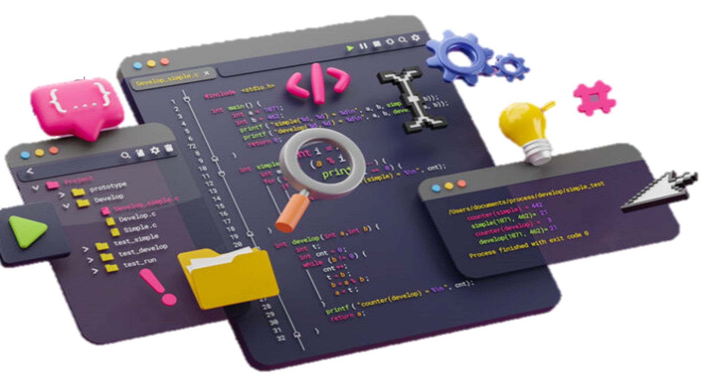

<header align="center">
  
  +DESENVOLVIMENTO+WEB;MINHA+EXPERIÊNCIA+>+6+MESES+EM+PROGRAMAÇÃO;SE+(CURTIU+MEU+TRABALHO)+SEGUE+%26%26+ESTRELA;OBRIGADO+:%29">
</header>

<section align="center">
  
  
</section>

##
### 👨🏻‍💻Sobre mim

 

* 💻Sou desenvolvedor Front-end
* 😀Gosto de programar e estou por dentro de todas as novas tecnologias
* 🕓Tenho quase 6 meses de experiência na área de programação
* ❇️ Tenho experiência em análise e desenvolvimento de sistemas

##

### 📦Habilidades principais

<section align="left">
  
  
  
</section>

### 🛠️Ferramentas

<section align="left">
  
  
  
  
  
  
  
</section>

### 🚩Outros conhecimentos

<section align="left">
  
  
</section>

### 📖Estudando neste momento

<section align="left">
  
  
</section>

### ✏️Áreas de interesse

<section align="left">
  
  
  
  
</section>

<h2 align="center">📈Git Stats</h2>

<section align="center">
  
</section>

##

### 🌟Curiosidades

* 🎮Gosto de jogar jogos eletrônicos: CS:GO, etc
* 🧩Gosto de jogar boardgame quando da vontade
* ♨️Gosto de assistir filmes e séries
* 🏖️Gosto de Jogar vôlei
* 🍕Comida preferida: Lasanha e Pizza

##

<section align="center">
  
</section>

<h2 align="center">📫Contatos</h2>

<section align="center">
  <a href="saulojustiniano1@gmail.com" target="_blank">
  <a href="https://www.youtube.com/channel/UC8pqvdCFakiAf0mJ4MfbKMA" target="_blank">
  <a href="https://www.twitch.tv/Sauron_F" target="_blank">
  <a href="https://twitter.com/SauloJustinian1" target="_blank">
  <a href="https://instagram.com/saulojustiniano" target="_blank">
  <a href="https://www.linkedin.com/in/saulojustiniano" target="_blank">
  <a href="https://discord.gg/93H3nmNkH3" target="_blank">
</section>

<footer align="center">
  
</footer>

<!-- <section align="center">
  
</section> -->

<!-- SauloJustiniano1/SauloJustiniano1 é um repositório ✨especial✨ que você pode usar para adicionar um README.mdao seu perfil do GitHub. Certifique-se de que é público e inicialize-o com um README para começar. -->
